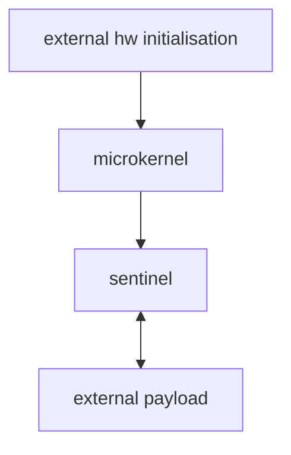

# System Overview

## 1. Purpose

### 1.1 BIOS functionnality reminders
Here we kindly remind what are the historical functionnality that BIOS implements.

#### 1.1.1 Fundamental Functions (MANDATORY)
These are the functions without which a system cannot boot correctly.

##### 1.1.1.1 Minimal Hardware Initialization (Hardware Init)

- Initialize the CPU (operating mode, microcode)
- Initialize system RAM (memory training)
- Configure the memory controller
- Initialize the chipset / SoC
- Configure system clocks
- Initialize essential controllers (SPI flash, internal buses)

Without these steps → execution of any code is impossible.  

##### 1.1.1.2 POST (Power-On Self-Test)

- Verify the presence of system RAM
- Detect critical hardware errors
- Validate CPU / chipset functionality
- Report fatal errors (beep codes, LEDs, logs)

##### 1.1.1.3 Firmware Storage Management

- Read its own firmware image from flash storage
- Manage variable storage (NVRAM / UEFI variables)
- Ensure data integrity

##### 1.1.1.4 Bootloader Selection and Loading

- Locate a bootable device
- Load a boot sector (legacy BIOS)
- Load an EFI application (UEFI)
- Transfer control to the operating system

##### 1.1.1.5 Firmware-to-OS Interface Provision

In legacy BIOS mode:  
Interrupt services (e.g., INT 13h disk services, INT 10h video services, etc.)

In UEFI mode:  
- Boot Services
- Runtime Services
- ACPI tables

#### 1.1.2 Required Functions on Modern Systems

##### 1.1.2.1 ACPI Management

- ACPI tables
- Device descriptions
- Power management states (S3, S4, S5)
- Wake-up event handling

Without ACPI → a modern operating system is not usable.

##### 1.1.2.2 Multiprocessor Management

- Start Application Processors (AP cores)
- Configure SMP (Symmetric Multiprocessing)
- Provide MADT (ACPI) tables

##### 1.1.2.3 Device Configuration

- PCI / PCIe enumeration
- BAR (Base Address Register) allocation
- IRQ configuration
- Bus management

##### 1.1.2.4 Advanced Memory Management

- A complete memory map
- Reserved memory regions
- MMIO regions
- DMA-safe memory regions

##### 1.1.2.5 Minimum Security Management

- Support Secure Boot (in a UEFI environment)
- Verify bootloader signatures
- Protect critical firmware variables

#### 1.1.3 Expected Functions on a Modern UEFI Platform

##### 1.1.3.1 Variable Services

- GetVariable
- SetVariable
- Persistent NVRAM management
- Authenticated variables support

##### 1.1.3.2 EFI Driver Management

- Load EFI drivers
- Manage EFI protocols
- Dispatch drivers through the EFI driver model

##### 1.1.3.3 Firmware Console

- Text output services
- Keyboard input services
- A setup utility (BIOS Setup interface)

##### 1.1.3.4 Boot Option Management

- BootOrder
- Boot#### variables
- Boot timeout
- BootNext

##### 1.1.3.5 Capsule Update

- Firmware update via capsule mechanism
- Rollback management
- Signature verification of update payloads

#### 1.1.4Advanced Security Functions
Strongly recommended in modern platforms:

- Measured Boot support
- TPM interaction
- PCR measurements
- Firmware rollback protection
- Flash write protection mechanisms

#### 1.1.5 Power Management Functions

- ACPI power states S0 / S3 / S4 / S5
- Wake-on-LAN
- RTC wake events
- Basic thermal management

#### 1.1.6 Optional but Commonly Implemented Functions

- PXE boot support
- USB boot support
- NVMe boot support
- Integrated EFI shell
- Hardware diagnostics
- Persistent logging
- Recovery mode support


### 1.2 Project objective of openUEFI

openUEFI is minimal harderned microkernel that offers a controled and secured execution environnement for external binary loading.

Microkernel is protecting. Sentinel is deciding. Payload is isolated

#### 1.2.1 Primary objectives

- Minimal secure execution environment 
- Secure loader framework 
- Hardened microkernel

openUEFI is not : 
- a concurrent and complete UEFI firmware
- an alternative solutiont to coreboot
- a bootloader (like GRUB)

#### 1.2.2 Strategic Objectives

- Minimalist firmware (< X LOC)
- Simplify the build system
- Reduce structural complexity
- Compatible with Linux HPC environments
- Minimal attack surface

#### 1.2.3 Supported architectures

- x86_64
- AARCH64

- Qemu
- _to be defined : some hardware boards_

## 2. Assumptions

The underlying firmware is considered untrusted and outside the Trusted Computing Base.
openUEFI assumes the platform has been correctly initialized but does not rely on any security guarantees provided by the firmware.
CPU is running correctly, and RAM is accessible and working fine. Hardware has been initialised by an external firmware (coreboot, EDK2,...)
The underlying firmware is not an active attaquant.

## 3. Threat Model
### 3.1 Assets
OpenUEFI guarantees

- Integrity of microkernel
- Integrity of Sentinel
- Integrity of boot
- Integrity of memory

- Confidentialité ?
- Chaîne de démarrage ?

### 3.2 Adversaries

- local (USB, disque)
- supply-chain (modified bootloader)
- external payload

- Attaquant firmware ?
- Attaquant physique ?

Pour chacun :
- Capacités
- Limites
### 3.3 Out of Scope
Exemples :

- Attaques matérielles physiques
- Firmware malveillant actif
- CPU compromis
- Side-channel

# 4. Trusted Computing Base
The trusted computing base (TCB) of a computer system is the set of all hardware, firmware, and/or software components that are critical to its security, in the sense that bugs or vulnerabilities occurring inside the TCB might jeopardize the security properties of the entire system. By contrast, parts of a computer system that lie outside the TCB must not be able to misbehave in a way that would leak any more privileges than are granted to them in accordance to the system's security policy.

## 4.1 Inside TCB
Their correctness/reliability is essential to ensure that the system’s security policies are enforced.  

- microkernel : secured by design.
- sentinel : will decide if operations are allowed or not)
- uefi shim (if it remains in project. probably yes, because we will boot on coreboot for hw initialisation at first). will provide UEFI compliance based on hardware accesses

## 4.2 Outside TCB
They are “untrusted by design,” and the system must strictly confine their privileges to prevent faults from resulting in security breaches.

- sentinel : will decide if loading is allowed or not. It is a privilegied component, but not trusted.
- uefi shim (if it remains in project. probably yes, because we will boot on coreboot for hw initialisation at first). will provide UEFI compliance based on hardware accesses
- external firmware (hw initialisation)
- external payload : cannot be trusted at all...
- CPU 
- RAM 

- TPM ?

par contre, je me demande comment on va pouvoir bloquer les access de tout ce qui n'est pas dans la TCB...

# 5. Security Invariants
Exemples d’invariants possibles :

- Le microkernel n’écrit jamais sur disque
- Le Sentinel ne peut pas modifier le microkernel
- Les binaires chargés sont read-only
- Aucun code non validé n’est exécuté
- La memory map est reconstruite indépendamment du firmware

# 6. Security Goals

- Détecter toute modification binaire => checksum ?
- Empêcher exécution hors zone autorisée => il faudra demander l'autorisation au sentinel ?
- Refuser tout binaire non validé => mecanisme de signature, etc...
- Journaliser toute violation

# 7. Security Non-Goals
- openUEFI n’est pas un OS
- openUEFI n’est pas un hyperviseur
- openUEFI ne garantit pas la confidentialité des données utilisateur
- openUEFI ne protège pas contre un firmware malveillant

## 2. Scope

### 2.1 Supported architectures

- x86_64
- AARCH64

### 2.2 Supported platforms

- Qemu
- _to be defined : some hardware boards_

### 4.4 Security-first approach
From the help of an LLM, 7 generals threat are described here, that comes from historical analysis : 

| Vulnerability Class                                  | Description / Historical Exposure                                        |
| ---------------------------------------------------- | ------------------------------------------------------------------------ |
| **1. Malicious / Unverified Drivers**                | Code injected via optional drivers, often with full privileges           |
| **2. Secure Boot Bypass / Compromised Key**          | Attacks on PK/KEK/DB chain-of-trust, incorrect signatures, UEFI exploits |
| **3. ACPI / System Table Corruption**                | Modification or falsification of ACPI tables, SMBIOS, etc.               |
| **4. DMA / Poorly Initialized Devices Exploitation** | Rogue DMA or misconfigured PCI devices, potential memory corruption      |
| **5. Runtime Services / UEFI Calls Corruption**      | Unsecured runtime services, manipulation of UEFI APIs to execute code    |
| **6. Buffer Overflow / Null Pointer / Large Code**   | Code size and complexity → memory vulnerabilities                        |
| **7. Bootkits / Measured Boot Bypass**               | Attacks modifying firmware without being detected                        |

#### 4.4.2 Proof of concept
See issue #4

