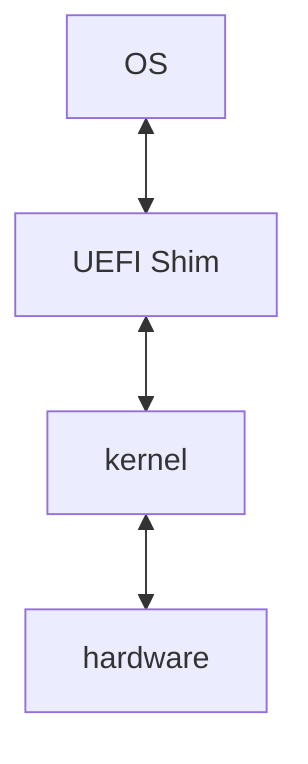

# System Overview

## 1. Purpose

### 1.1 BIOS functionnality reminders
Here we kindly remind what are the historical functionnality that BIOS implements.

#### 1.1.1 Fundamental Functions (MANDATORY)
These are the functions without which a system cannot boot correctly.

##### 1.1.1.1 Minimal Hardware Initialization (Hardware Init)
The firmware MUST:  

- Initialize the CPU (operating mode, microcode)
- Initialize system RAM (memory training)
- Configure the memory controller
- Initialize the chipset / SoC
- Configure system clocks
- Initialize essential controllers (SPI flash, internal buses)

Without these steps → execution of any code is impossible.  

##### 1.1.1.2 POST (Power-On Self-Test)
The firmware MUST:  

- Verify the presence of system RAM
- Detect critical hardware errors
- Validate CPU / chipset functionality
- Report fatal errors (beep codes, LEDs, logs)

##### 1.1.1.3 Firmware Storage Management
The BIOS MUST:

- Read its own firmware image from flash storage
- Manage variable storage (NVRAM / UEFI variables)
- Ensure data integrity

##### 1.1.1.4 Bootloader Selection and Loading
This is an ABSOLUTELY central function:  

- Locate a bootable device
- Load a boot sector (legacy BIOS)
- Load an EFI application (UEFI)
- Transfer control to the operating system

##### 1.1.1.5 Firmware-to-OS Interface Provision
The firmware MUST expose:

In legacy BIOS mode:  
Interrupt services (e.g., INT 13h disk services, INT 10h video services, etc.)

In UEFI mode:  
- Boot Services
- Runtime Services
- ACPI tables

#### 1.1.2 Required Functions on Modern Systems

##### 1.1.2.1 ACPI Management

The firmware MUST provide:

- ACPI tables
- Device descriptions
- Power management states (S3, S4, S5)
- Wake-up event handling

Without ACPI → a modern operating system is not usable.

##### 1.1.2.2 Multiprocessor Management
The firmware MUST:  

- Start Application Processors (AP cores)
- Configure SMP (Symmetric Multiprocessing)
- Provide MADT (ACPI) tables

##### 1.1.2.3 Device Configuration
The firmware MUST perform:  

- PCI / PCIe enumeration
- BAR (Base Address Register) allocation
- IRQ configuration
- Bus management

##### 1.1.2.4 Advanced Memory Management
The firmware MUST provide:  

- A complete memory map
- Reserved memory regions
- MMIO regions
- DMA-safe memory regions

##### 1.1.2.5 Minimum Security Management
A modern firmware MUST:  

- Support Secure Boot (in a UEFI environment)
- Verify bootloader signatures
- Protect critical firmware variables

#### 1.1.3 Expected Functions on a Modern UEFI Platform
On a UEFI-compliant platform, the firmware MUST also provide:  

##### 1.1.3.1 Variable Services
The firmware MUST implement:  

- GetVariable
- SetVariable
- Persistent NVRAM management
- Authenticated variables support

##### 1.1.3.2 EFI Driver Management
The firmware MUST:  

- Load EFI drivers
- Manage EFI protocols
- Dispatch drivers through the EFI driver model

##### 1.1.3.3 Firmware Console
The firmware MUST provide:  

- Text output services
- Keyboard input services
- A setup utility (BIOS Setup interface)

##### 1.1.3.4 Boot Option Management
The firmware MUST manage:  

- BootOrder
- Boot#### variables
- Boot timeout
- BootNext

##### 1.1.3.5 Capsule Update
The firmware MUST support:  

- Firmware update via capsule mechanism
- Rollback management
- Signature verification of update payloads

#### 1.1.4Advanced Security Functions
Strongly recommended in modern platforms:

The firmware SHOULD provide:

- Measured Boot support
- TPM interaction
- PCR measurements
- Firmware rollback protection
- Flash write protection mechanisms

#### 1.1.5 Power Management Functions
The firmware SHOULD support:

- ACPI power states S0 / S3 / S4 / S5
- Wake-on-LAN
- RTC wake events
- Basic thermal management

#### 1.1.6 Optional but Commonly Implemented Functions
The firmware MAY provide:

- PXE boot support
- USB boot support
- NVMe boot support
- Integrated EFI shell
- Hardware diagnostics
- Persistent logging
- Recovery mode support


### 1.2 Project objective of openUEFI
Develop a UEFI-compliant firmware from scratch, without using EDK2, based on a clear, modular, and extensible microkernel architecture.

#### 1.2.1 Primary objectives
- Simplify the build system
- Reduce structural complexity
- Achieve a deep understanding of the UEFI architecture
- Create a modern and maintainable alternative implementation

#### 1.2.2 Strategic Objectives

- Minimalist firmware (< X LOC)
- Compatible with Linux HPC environments
- Minimal attack surface
- Complete and correct ACPI implementation
- Essential UEFI compliance

### 1.3 Logical view

#### 1.3.1 Recommendations

##### 1.3.1.1 kernel

Kernel must remain minimal. So, kernel must only implement : 

- correct initialisation of the plateforme
- guarantee securirty
- generate correct ACPI tables
- furnish correct data to UEFI shim

| Level                | Recommandations  |
| -------------------- | ---------------- |
| code organisation    | Micro-modularity |
| Compilation          | Static           |
| Runtime              | Monolithic       |
| Scheduler            | None             |
| IPC                  | None             |
| Dynamic load         | No               |

##### 1.3.1.2 UEFI Shim

- expose EFI System Table
- expose Boot Services essentiels
- expose minimal Runtime Services 
- furnish pointers to ACPI tables
- translate UEFI calls into internal kernel structures

## 2. Scope

### 2.1 Supported architectures

- x86_64
- AARCH64

### 2.2 Supported platforms

- Qemu
- _to be defined : some hardware boards_

## 3. High-Level Boot Flow

### 3.1 Reset vector entry
_to be defined_
### 3.2 Kernel initialization
_to be defined_

### 3.3 Handoff to UEFI shim
_to be defined_

## 4. Design Principles
_to be defined_

### 4.1 Minimal TCB
_to be defined_

### 4.2 Deterministic execution
_to be defined_

### 4.3 Hardware abstraction boundaries
_to be defined_

### 4.4 Security-first approach
From the help of an LLM, 7 generals threat are described here, that comes from historical analysis : 

| Vulnerability Class                                  | Description / Historical Exposure                                        |
| ---------------------------------------------------- | ------------------------------------------------------------------------ |
| **1. Malicious / Unverified Drivers**                | Code injected via optional drivers, often with full privileges           |
| **2. Secure Boot Bypass / Compromised Key**          | Attacks on PK/KEK/DB chain-of-trust, incorrect signatures, UEFI exploits |
| **3. ACPI / System Table Corruption**                | Modification or falsification of ACPI tables, SMBIOS, etc.               |
| **4. DMA / Poorly Initialized Devices Exploitation** | Rogue DMA or misconfigured PCI devices, potential memory corruption      |
| **5. Runtime Services / UEFI Calls Corruption**      | Unsecured runtime services, manipulation of UEFI APIs to execute code    |
| **6. Buffer Overflow / Null Pointer / Large Code**   | Code size and complexity → memory vulnerabilities                        |
| **7. Bootkits / Measured Boot Bypass**               | Attacks modifying firmware without being detected                        |

#### 4.4.2 Proof of concept
See issue #4

